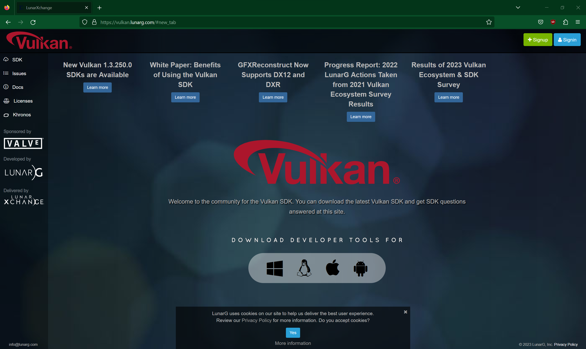

## Download and Set up

Usually when developing code you want to have an integrated tool, such as visual studio or visual studio code to compile and provide you with Intelisense which facilitates your development process. This step will teach you how you can set up curan in your personal machine. 

1. Download Github Desktop : for this step follow [these instructions](https://docs.github.com/en/desktop/installing-and-configuring-github-desktop/installing-and-authenticating-to-github-desktop/installing-github-desktop)

Once this step is complete make sure you have acess to the Curan source code on [github](https://github.com/Human-Robotics-Lab/Curan/tree/main)

2. Now you need to install the Vulkan SDK in your machine. Download the correct version from [this website](https://vulkan.lunarg.com/#new_tab)


3. On windows install visual studio community edition with all the C++ compilers and Cmake tools

On linux install the build essencial tools in your command line with : sudo apt-get install build-essencials

4. Install the Visual Studio Code IDE from [this website](assets/images/vulkan_studio_code.png) 

## Understand the structure

So you have found yourself in front of Curan and you have sucessefully compiled the Curan SDK without any errors. Now you have a goal in mind and want to start implementing your own custom solutions for your medical applications. Well, this tutorial introduces the base cases of the classes available to achieve your goals. 

Curan is divided into sic main portions, so called libraries.

1. You have a utilities library which contains things usefull in multithreaded scenarios, blocking queues, atomic flags and so on. 

2. Then you have a user interface library. This component of curan is build on top of two main libraries, Vulkan to actually communicate with your GPU and SKIA which allows you to render any geometry on screen. We choose these two solutions for two main reasons, Vulkan is a recent API, which means that it will have support for a long time whilst SKIA is the rendering engine used by google to draw geometries across most browsers.

3. The third library is for communication, where currently Serial communication is implemented and TCP/IP communication is implemented with the OpenIGTLink protocol. 

4. The fourth library is the imageprocessing module, where volumetric reconstruction algorithms are implemented. 

5. The fifth library is the rendering one, which uses VSG to render 3D scenes on the environment. 

6. The last patch is the optimization library which contains the Ceres solver to optimize the configuration of the wires whilst doing ultrasound calibration. 

We will introduce each of these modules in separate sections of this website, but for now we will also give you an overview of the logic behind the project layout, for you to feel more confortable manipulating and changing the website as required. On all CMake based projects there is always a root directory to declare and configure a given project. This is the folder Curan with the following structure

```
Curan ---
        |->Curan
        |
        |->Documentation
        |
        |->CMakeLists.txt
        |
        |->vcpkg.json
```

The reason we have two folders named curan is because we are using a tecnique simillar to what some might call super build in cmake parley. This strategy is required because the libraries associated with VSG currently have not been integrated into the other strategy we use to pull in 3d party libraries, namely vcpkg. This is a package manager where you tell it which libraries you want, and the manager pulls in the necessary projects into your own project. This is how most of our third_parties are pulled in. Now that you understand why we have this commical structure lets go into the actual folder which contains Curan

```
Curan ---
        |->Curan  <- this one
        |
        |->Documentation
        |
        |->CMakeLists.txt
        |
        |->vcpkg.json
```

Inside this project you have a cmake which defines the curan project. This folder contains a third_party folder (ignore this, we need it because some libraries we need are not compatible with cmake, thus we had to write a local port in our project to use them), a tests folder, a src folder (this is for legacy purposes, ignore it this is not used by Curan), a resources folder, libraries and an applications folder. Now we can explain the purpose of each of them but first lets understand just a bit of cmake for everything to make sense in your mind. You have just written this awesome amount of code with three cpp files which execute your briliant algorithm and you want to allow other people to use your code. So you define a target and attach the include directories of you awesome code to this target.

```cmake
add_library(MyLibrary STATIC
sourcecode1.cpp
sourcecode2.cpp
sourcecode3.cpp
)

target_include_directories(MyLibrary PUBLIC "/some/path")
```

This command implies that you have defined a target called MyLibrary which is composed of the three source files and the include directories of your project as specified with 'targe_include_directories', and anyone who wants to use your code can simply attach your target as such 

```cmake
add_executable (OtherPersionExecutable 
main.cpp
)

target_include_directories(OtherPersionExecutable PUBLIC MyLibrary)
```

With this you can share your code with others for their purpouses. 

# Libraries folder

Given the previous explainantion you will now see that the libraries folder contains code encapsulated in 6 distinct targets, i.e. libraries, which serve distinct purposes. Usually you should only mess with this file if you want to add libraries to curan. 

# Tests folder

Because we are programmers, we need to test ideias, prototype until we are happy with the performance of the code we developed. This folder contains tests writtes to demonstrate how to use the targets defined in the libraries folder. You can add your own tests as you wish. 
Simply define your executable and link the necessary targets, e.g. assume that you want to use the utilities target, then you just need to create a file in the tests folder, and write a CMakeLists.txt of that directory the following 

```cmake
add_executable(bar test_utils.cpp)

target_link_libraries(bar PUBLIC
utils
)

```

For further information you can check out some of the examples in this repository to see how to use each target. 

# Resources folder

Sometimes you need a file to test your code, be it an image on a json file. Usualy the best way to write code to parse this files is to accept an argument from the command line in your executable as follows 

```cpp
#include <iostream>

int main(int argc, char* argv[]){
        if(argc<=1){
                std::cout << "this executable needs to be feed one file of the json we want"
                return 1;
        } 
        std::string path_to_file{argv[1]};
        //further use of the path where the desired file is
        return 0;
}
```

But when you want to prototype quickly sometimes it would be better to have a folder which is automatically copied into the location where we are building our application and call the files from that directory. Curan achieves this by creating a dummy target, associated with the location of the directory with the resources we need. 

```cmake 
add_custom_command(OUTPUT resources
               COMMAND ${CMAKE_COMMAND} -E copy_directory ${original_resource_paths} ${post_build_resource_path}
               DEPENDS "${original_resource_paths}"
               COMMENT "Currently copying the widget files to the correct directories"
               )

add_custom_target(
  curan_resources
  DEPENDS resources
)
```

When you want to use this location in one of your executables we can define a macro from cmake as such 

```cmake 
add_executable(foo main.cpp)

target_compile_definitions(foo PRIVATE CURAN_COPIED_RESOURCE_PATH="${post_build_resource_path}")
)
```

which automatically injects the path where cmake copies our files into, and now in your cpp you can simply write 

```cpp
int main(){
        std::string path_to_our_files filepath{CURAN_COPIED_RESOURCE_PATH"/images"};
        return 0;
}

```

# Applications folder

The applications folder contains demos which should always compile and work. These applications should be something stable and you should only add yours once your trully have testing your code in the tests folder. 