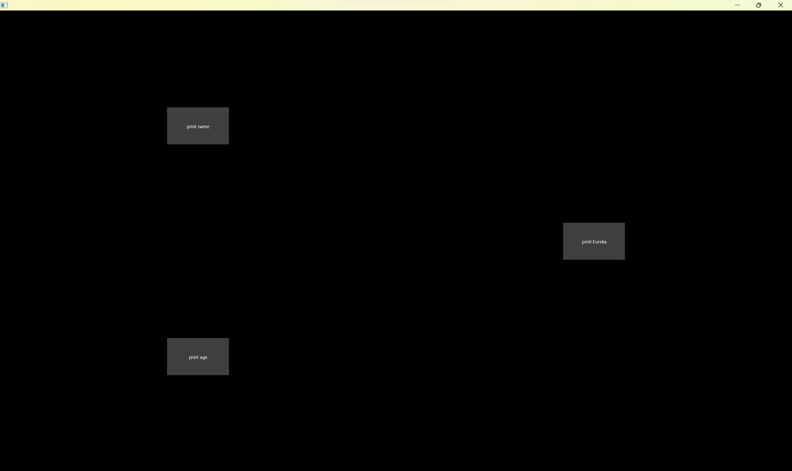
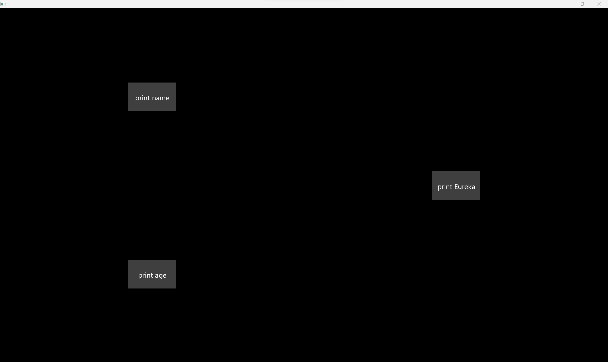
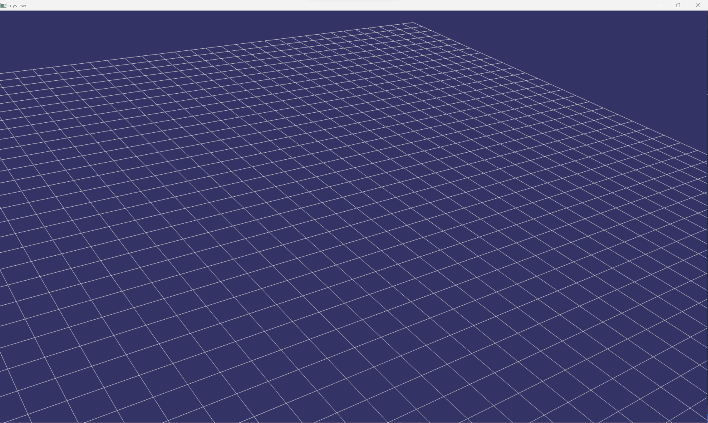
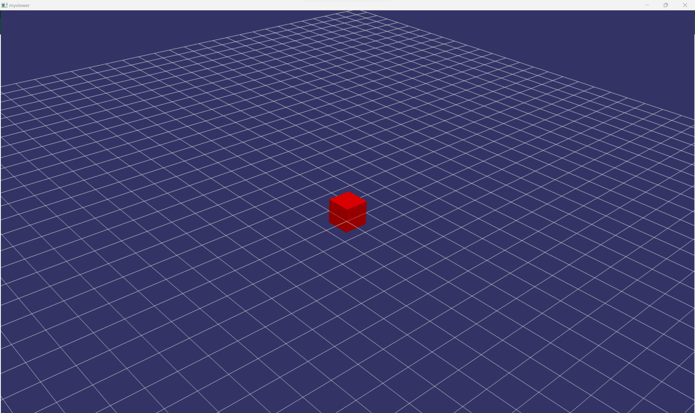
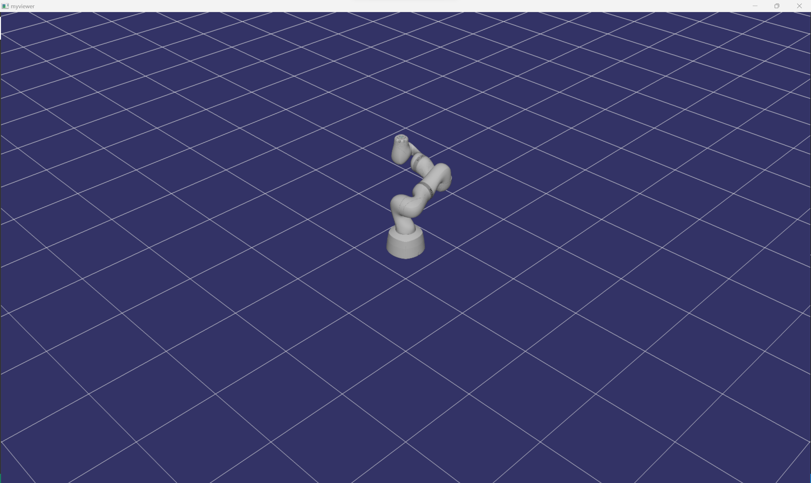

Once you have understood the layout of the curan project we are ready to dwelve deep into the curan API and how you can achieve your goals.

## All the tutorials currently available

* Utilities : [Utilities](#utilities)
* User Interface : [User Interface](#user-interface)
* 3D Rendering : [3D Rendering](#3d-rendering)
* Optimization : [Optimization](#optimization)
* Communication : [Communication](#communication)
* Image Processing : [Image Processing](#image-processing)
* Building Complex Programs : [Complex Programs](#complex-programs)
### Utilities

The utilities library is contained in the Curan API is located in the library folders in the utils folder. In CMAKE the target of the library is 'utils' and tu use it you can define a CMakeLists.txt with the following content 

```cmake
add_exectutable(myexample main.cpp)

target_link_libraries(myexample PUBLIC
utils
)
```

This code signals to CMake that our target depends on utils and when we compile it we must have the relative paths to both the include directories and the library files of the utils target. Now we will introduce a bit of the library for you to get a better graps of when and where to use it.

# SafeQueue

Assume that you have two functions, one which reads input from the keyboard and commands how large the gains of your controller (lets call this function foo) and another that establishes a serial connection with an arduino where you send the control commands in real time (bar function) and you want to use the information from the first function to update the controllers of the second. 

```cpp
#include <iostream>
#include <asio.hpp>

int foo();
int bar();

int main(){
    std::thread io_thread{foo};
    bar();
    io_thread.join();
    return 0;
}

```

Where the source code of the foo function is given by 

```cpp
int foo(){
    char input;
    while(true){
        std::cin >> input; //this call blocks until input is provided
        switch(input){
            case 'a': //agressive -> gain 3
            break;
            case 's': //smooth -> gain 1
            break;
            case 'x': //stop control
            break;
            default: //do nothing
            break;
        }
    }
}
```

and the bar function is given by 

```cpp
int bar(){
    asio::io_context context;
    asio::serial_port serial(context);
    serial.open("COM1");
    double gain = 1;
    std::string control_action;
    while(true){
        //we need to check if our agressive control law must change or not 
        asio::write(serial,asio::buffer(control_action.data(),control_action.size()));
    }
}
```

How would you establish the communication between these two functions?
You could develop a atomic flag which signals when something has changed in one thread and read a value when this flag is changed, i.e.

```cpp
int foo(std::atomic<bool>& flag_to_signal,double* value){
    char input;
    while(true){
        std::cin >> input; //this call blocks until input is provided
        switch(input){
            case 'a': //agressive -> gain 3
            *value = 3;
            flag_to_signal.store(true);
            break;
            case 's': //smooth -> gain 1
            *value = 1;
            flag_to_signal.store(true);
            break;
            case 'x': //stop control
            flag_to_signal.store(true);
            *value = 0;
            break;
            default: //do nothing
            break;
        }
    }
}
```

```cpp
int bar(std::atomic<bool>& flag_to_signal,double* value){
    asio::io_context context;
    asio::serial_port serial(context);
    serial.open("COM1");
    double gain = 1;
    std::string control_action;
    while(true){
        if(flag_to_signal.load()){
            flag_to_signal.store(false);
            gain = *value;
            if(gain==0){ //x was pressed we need to stop
                serial.close();
                return 1;
            }
        }
        control_action = std::to_string(gain);
        asio::write(serial,asio::buffer(control_action.data(),control_action.size()));
    }
}
```

And your main function is something similar to 


```cpp
#include <iostream>
#include <asio.hpp>

int foo();
int bar();

int main(){
    std::atomic<bool> signal_flag = false;
    double gain_value = 1.0;
    std::thread io_thread{foo(signal_flag,&gain_value)};
    bar(signal_flag,&gain_value);
    io_thread.join();
    return 0;
}

```

This almost works, there is a bug hidden in the example. Because we are acessing the control_law double memory location from both threads we have a [race condition](https://en.wikipedia.org/wiki/Race_condition) (to understand the read the [cpp memory model](https://en.cppreference.com/w/cpp/language/memory_model)) (one thread could be stopped whilst we were writing to the double and in the meantime we read this value which contains nonsense until the writing operation is finished). To avoid this, the double variable should also be atomic to guarantee that changes are updated in a single shot. As you can see, designing memory safe code is dificult and requires constant attention. 

To deal with these problems curan proposes the class 'SafeQueue' which is basically a queue which we can put things into and request to pull things out of as needeed with guaranteed memory safety. 

```cpp
#include "utilities/SafeQueue.h"

int foo(curan::utilitites::SafeQueue<double>& queue){
    char input;
    while(true){
        std::cin >> input; //this call blocks until input is provided
        switch(input){
            case 'a': //agressive -> gain 3
                queue.push(3.0);
            break;
            case 's': //smooth -> gain 1
                queue.push(1.0);
            break;
            case 'x': //stop control
                queue.push(0.0);
                return 0;
            break;
            default: //do nothing
            break;
        }
    }
}
```

```cpp 
#include "utilities/SafeQueue.h"
int bar(curan::utilitites::SafeQueue<double>& queue){
    asio::io_context context;
    asio::serial_port serial(context);
    serial.open("COM1");
    double gain = 1;
    std::string control_action;
    while(true){
        if(queue.try_pop(gain) && gain==0){
            serial.close();
            return 1;
        }
        control_action = std::to_string(gain);
        asio::write(serial,asio::buffer(control_action.data(),control_action.size()));
    }
}
```

```cpp
#include "utilities/SafeQueue.h"

int foo(curan::utilitites::SafeQueue<double>& queue);

int bar(curan::utilitites::SafeQueue<double>& queue);

int main(){
    curan::utilitites::SafeQueue<double> queue;
    std::thread io_thread{foo(queue)};
    bar(queue);
    io_thread.join();
    return 0;
}

```

This solution reduces code size and guarantees that reading and writing to the queue is safe across threads.

# ThreadPool and Jobs

Now lets look at another handy tool in curan which you might need to use in your code. You have an operation which might take a long time, e.g. image prcessing, and as soon as you receive an image you want to launch a thread to process this task whilst dealing with other things, you don't want to wait for the operation to finish in your main thread. 

Here is how one might try and implement this solution

```cpp 

#include "itkImage.h"

using PixelType = unsigned char;
using Dimension = 2;
using ImageType = itk::Image<PixelType, Dimension>;

ImageType::Pointer magicfunction_returns_image();
void slow_image_filter(ImageType::Pointer);

int main(){
    bool continue_running = true;
    std::vector<std::thread> list_of_threads_running;
    while(continue_running){
        ImageType::Pointer image = magicfunction_returns_image();
        if(image.get()!=nullptr)
            list_of_threads_running.emplace_back(std::thread(slow_image_filter(image)));
        else
            continue_running = false;
    }
    for(auto & thread : list_of_threads_running)
        thread.join();
    return 0;
}
```
We keep looping and getting more images and our slow filter takes these images and is started on a parallel thread which runs our task. This solution has several problems, namely, the number of threads we create is unlimited, which is not always want we want. Remember that your core has a finite number of cores and at some point you will create too many threads which the kernel of the operating system might need to switch between (which takes time). The other drawback of the tecnique is that creating a thread is an "expensive" operation. This is where thread pools come into play.
What if you create a pool of prealocated threads and give them the task you wish to execute? This number of threads would be limited and you would not pay for the creation of the threads as the while loop runs. 

To achieve this solution curan has the concept of a Job. A job contains a description of the task being executed and a [lambda](https://en.cppreference.com/w/cpp/language/lambda) which captures our local variables that we want to use in the future. Inside this lambda we provide it with a copy of the pointer to our image and we call our slow filter. Once the while filter is finished we terminate the thread pool. If you are curious, check how the thread pool is implemented. Its not that difficult to understand.

```cpp

#include "itkImage.h"

using PixelType = unsigned char;
using Dimension = 2;
using ImageType = itk::Image<PixelType, Dimension>;

ImageType::Pointer magicfunction_returns_image();
void slow_image_filter(ImageType::Pointer);

int main(){
    //initualize the thread pool;
	curan::utilities::initialize_thread_pool(10);
    bool continue_running = true;
    
    while(continue_running){
        ImageType::Pointer image = magicfunction_returns_image();
        if(image.get()==nullptr){
            continue_running = false;
            continue;
        }
        curan::utilities::Job job_to_execute;
	job_to_execute.description = "Job to execute";
        job_to_execute.function_to_execute = [image]() {
            slow_image_filter(image);
	    };
        curan::utilities::pool->submit(job_to_execute);
    }
    curan::utilities::terminate_thread_pool();
    return 0;
}
```

# Flags

The last flag which is notable and usefull in your day to day inside the utilities target are multihtreaded safe flags. So you are in a situation where 
you want to wait for a boolean variable to turn positive. This waiting can be achieved with a multitude of tecniques. An amatuer implementation of this behavior would be something like

```cpp
#include <atomic>

int foo(std::atomic<bool>& variable){
    //this function does something important that we need to wait on
    // ...

    variable.store(true);
}

int main(){
    std::atomic<bool> flag_to_wait = false;
    std::thread local_thread(foo(flag_to_wait));
    //we do something in the mean time while waiting for this task to be over
    // ...

    //After doing in parallel what we needed to do, we must wait for the variable to be trur
    while(flag_to_wait.load()) {}; //this loop keeps running until the variable is true

    //now we can execute what needs to be executed because the variable is true
    // ... 
    return 0;
}
```

Notice that this naive implementation wastes alot of cpu cycles because the main thread keeps evaluating the variable, which is wastefull. The behavior we want is to block until the variable is true. Curan does this through the class Flag as follows:

```cpp
#include "utilities/Flag.h"

int foo(std::shared_ptr<curan::utilities::Flag> shared_flag){
    //this function does something important that we need to wait on
    // ...

    shared_flag->set();
}

int main(){
    auto flag = curan::utilities::Flag::make_shared_flag();
    std::thread local_thread(foo(flag));
    //we do something in the mean time while waiting for this task to be over
    // ...

    flag->wait();
    //now we can execute what needs to be executed because the variable is true
    // ... 
    return 0;
}
```

Internally this code uses condition variables to force threads to sleep. This saves the CPU of waiting uncessaryly while instead we ask the operating system to wake us up when necessary.

### User-Interface

The user interface library is build upon [SKIA](https://skia.org/). This is a great library in cpp which renders geometries, images, paths, and many other geometries. Check the SKIA [API](https://skia.org/docs/user/api/) to see what is possible. The main thing you need to understand is that Curan only executes the connection between the GPU and your CPU, all other things are taken care of by SKIA. 

The first step in all our programming is to properly link our executable to the user interface library, we can achieve this through.

```cmake
add_executable(myexecutable main.cpp)


target_link_libraries(myexecutable PUBLIC
userinterface
)
```
Now the compiler can link safely to our library. This is a snipeat of code which shows how you can create an empty canvas

```cpp
#define STB_IMAGE_IMPLEMENTATION
#include "userinterface/widgets/ConfigDraw.h"
#include "userinterface/Window.h"
#include "userinterface/widgets/IconResources.h"
#include <iostream>

int main() {
try {
	using namespace curan::ui;
	std::unique_ptr<Context> context = std::make_unique<Context>();;
	DisplayParams param{ std::move(context),1200,800 };
	std::unique_ptr<Window> viewer = std::make_unique<Window>(std::move(param));

    //Things that we will add in the next portion of the tutorial

	while (!glfwWindowShouldClose(viewer->window)) {
			auto start = std::chrono::high_resolution_clock::now();
			SkSurface* pointer_to_surface = viewer->getBackbufferSurface();
			SkCanvas* canvas = pointer_to_surface->getCanvas();
			canvas->drawColor(SK_ColorWHITE);
			
            //do your own things

			glfwPollEvents();
			auto signals = viewer->process_pending_signals();

			bool val = viewer->swapBuffers();
			if (!val)
				std::cout << "failed to swap buffers\n";
			auto end = std::chrono::high_resolution_clock::now();
			std::this_thread::sleep_for(std::chrono::milliseconds(16) - std::chrono::duration_cast<std::chrono::milliseconds>(end - start));
	}
	return 0;
}
catch (...) {
	std::cout << "Failed";
	return 1;
}
}
```

This source code creates a window through the [GLFW library](https://www.glfw.org/) which appends signals to the 'std::unique_ptr<Window> viewer' object. The types of signals Curan propagates are Empty,Move, Press, Scroll, Unpress, ItemDropped, Key. The move is a mouse movement, the Press is a mouse press, the scroll is the scroll with a mouse, the unpress is when the mouse is released, itemdropped is when you drag a item into the window and key is a keyboard press. 

# Button

This while loop runs until the window is closed. Now obviously you don't want to program all types of objects like buttons and so on, everytime you want this type of behavior. Curan has a light Widget implementation which you can use for your goals. Lets see how curan goes about defining this widget behavior

Assume that you want three buttons all with distict behavior:
1. Button 1 - name "print name" execution "prints a name when clicked"

2. Button 2 - name "print age" execution "prints an age when clicked"

3. Button 3 - name "print Eureka" execution "prints Eureka when clicked"

Further notice that we would like to control the colors when we are hovering with the mouse, when we click the button and while nothing is interacting with the button. This is controlled through the Button::Info structure feed into the constructor of Button. We would also like Button 1 to be above button 2 and these two are on the left side of button 3. To achieve this we must first create the buttons as follows

```cpp
std::unique_ptr<Button> button1 = Button::make("print name",resources);

std::unique_ptr<Button> button2 = Button::make("print age",resources);

std::unique_ptr<Button> button3 = Button::make("print eureka",resources);

```
Notice that the simplicity of creating these buttons, you dont need a lot of work to get buttons up a running. By default they have a custom coloring scheme when you hover, when you click, etc.. Assume that you want to custumize the look the buttons. Btw because we are fancy, we can use the auto keyword to reduce the amount of lines of code we need to write as such (auto deduces the type of the object at compile time, thus both expressions are equivalent)

```cpp
auto button1 = Button::make("print name",resources);
button1->set_click_color(SK_ColorGRAY).set_hover_color(SK_ColorDKGRAY).set_waiting_color(SK_ColorBLACK).set_size(SkRect::MakeWH(100, 80));

auto button2 = Button::make("print age",resources);
button2->set_click_color(SK_ColorGRAY).set_hover_color(SK_ColorDKGRAY).set_waiting_color(SK_ColorBLACK).set_size(SkRect::MakeWH(100, 80));

auto button3 = Button::make("print eureka",resources);
button3->set_click_color(SK_ColorGRAY).set_hover_color(SK_ColorDKGRAY).set_waiting_color(SK_ColorBLACK).set_size(SkRect::MakeWH(100, 80));
```

Notice that we can compose calls in sequence when configuring buttons, this applies to most functions of the object (after the set_size call you can't compose more calls in sequence because the method does not return a reference to our object). The only thing we are missing is to customize the callback that we desire for our object as such

```cpp
auto button1 = Button::make("print name",resources);
button1->set_click_color(SK_ColorGRAY).set_hover_color(SK_ColorDKGRAY).set_waiting_color(SK_ColorBLACK).set_size(SkRect::MakeWH(100, 80));
button1->set_callback([](Button* button,ConfigDraw* config){
    std::cout << "my name is Eminem\n";
});
auto button2 = Button::make("print age",resources);
button2->set_click_color(SK_ColorGRAY).set_hover_color(SK_ColorDKGRAY).set_waiting_color(SK_ColorBLACK).set_size(SkRect::MakeWH(100, 80));
button2->set_callback([](Button* button,ConfigDraw* config){
    std::cout << "I am old\n";
});
auto button3 = Button::make("print eureka",resources);
button3->set_click_color(SK_ColorGRAY).set_hover_color(SK_ColorDKGRAY).set_waiting_color(SK_ColorBLACK).set_size(SkRect::MakeWH(100, 80));
button3->set_callback([](Button* button,ConfigDraw* config){
    std::cout << "Eureka, I wrote a rime\n";
});
```

Now the buttons have some of the desired behavior we desire, but some things are still missing, such as their layout. To control the layout of buttons on screen Curan has the concept of a container. Containers are objects which contain other objects, be them widgets, or other containers. Given the specification of the buttons we defined we need two containers. One which is a vertical container which contains button 1 and 2 and an horizontal container which contains the first container and button 3. This is done as follows

```cpp
auto button1 = Button::make("print name",resources);
button1->set_click_color(SK_ColorGRAY).set_hover_color(SK_ColorDKGRAY).set_waiting_color(SK_ColorBLACK).set_size(SkRect::MakeWH(100, 80));
button1->set_callback([](Button* button,ConfigDraw* config){
    std::cout << "my name is Eminem\n";
});
auto button2 = Button::make("print age",resources);
button2->set_click_color(SK_ColorGRAY).set_hover_color(SK_ColorDKGRAY).set_waiting_color(SK_ColorBLACK).set_size(SkRect::MakeWH(100, 80));
button2->set_callback([](Button* button,ConfigDraw* config){
    std::cout << "I am old\n";
});
auto button3 = Button::make("print eureka",resources);
button3->set_click_color(SK_ColorGRAY).set_hover_color(SK_ColorDKGRAY).set_waiting_color(SK_ColorBLACK).set_size(SkRect::MakeWH(100, 80));
button3->set_callback([](Button* button,ConfigDraw* config){
    std::cout << "Eureka, I wrote a rime\n";
});

auto buttoncontainer = Container::make(Container::ContainerType::LINEAR_CONTAINER,Container::Arrangement::VERTICAL);
*buttoncontainer << std::move(button1) << std::move(button2);

auto widgetcontainer = Container::make(Container::ContainerType::LINEAR_CONTAINER,Container::Arrangement::HORIZONTAL);
*widgetcontainer << std::move(buttoncontainer) << std::move(button3);
 ```

This takes the total available space on screen and by default it lays out our objects on screen. If you want to control how must space each object has, we can specify the related spacing as such 

```cpp
auto button1 = Button::make("print name",resources);
button1->set_click_color(SK_ColorGRAY).set_hover_color(SK_ColorDKGRAY).set_waiting_color(SK_ColorBLACK).set_size(SkRect::MakeWH(100, 80));
button1->set_callback([](Button* button,ConfigDraw* config){
    std::cout << "my name is Eminem\n";
});
auto button2 = Button::make("print age",resources);
button2->set_click_color(SK_ColorGRAY).set_hover_color(SK_ColorDKGRAY).set_waiting_color(SK_ColorBLACK).set_size(SkRect::MakeWH(100, 80));
button2->set_callback([](Button* button,ConfigDraw* config){
    std::cout << "I am old\n";
});
auto button3 = Button::make("print eureka",resources);
button3->set_click_color(SK_ColorGRAY).set_hover_color(SK_ColorDKGRAY).set_waiting_color(SK_ColorBLACK).set_size(SkRect::MakeWH(100, 80));
button3->set_callback([](Button* button,ConfigDraw* config){
    std::cout << "Eureka, I wrote a rime\n";
});

auto buttoncontainer = Container::make(Container::ContainerType::LINEAR_CONTAINER,Container::Arrangement::VERTICAL);
*buttoncontainer << std::move(button1) << std::move(button2);
buttoncontainer->set_division({0.0 0.3 1.0});

auto widgetcontainer = Container::make(Container::ContainerType::LINEAR_CONTAINER,Container::Arrangement::HORIZONTAL);
*widgetcontainer << std::move(buttoncontainer) << std::move(button3);
widgetcontainer->set_division({0.0 0.6 1.0});
 ```

 Now button 1 and 2 will ocupy 60% of the screen horizontally and 30% for button 1 vertically and 70% for button 2 while button 3 ocupies 40% horizontally and 100% vertically.

Now we need to draw the containers somehow. We do this by creating a page. A page contains one container which can itself contain containers recursivelly. This allows us to create a tree structure of things to draw on screen. Because our containers are already completly defined we just need to tell the page that it must draw the widgetcontainer

```cpp
auto rec = viewer->get_size();
Page page = Page{widgetcontainer, SK_ColorBLACK};
page.propagate_size_change(rec);
```

We query the size of the viewer and propagate this size throught the page so that all widgets/ containers compute their relative position on screen.
With this we finaly have a page that we can draw. Lets look at the loop which draws our window

```cpp
int width = rec.width();
int height = rec.height();

ConfigDraw config{&page};

while (!glfwWindowShouldClose(viewer->window)) {
	auto start = std::chrono::high_resolution_clock::now();
	SkSurface* pointer_to_surface = viewer->getBackbufferSurface();
	auto temp_height = pointer_to_surface->height();
	auto temp_width = pointer_to_surface->width();
	SkCanvas* canvas = pointer_to_surface->getCanvas();
	if (temp_height != height || temp_width != width) {
		rec = SkRect::MakeWH(temp_width, temp_height);
		page->propagate_size_change(rec);
    }
	page->draw(canvas);
	auto signals = viewer->process_pending_signals();
	if (!signals.empty())
		page->propagate_signal(signals.back(),&config);
	glfwPollEvents();
	
	bool val = viewer->swapBuffers();
	if (!val)
		std::cout << "failed to swap buffers\n";
	auto end = std::chrono::high_resolution_clock::now();
	std::this_thread::sleep_for(std::chrono::milliseconds(16) - std::chrono::duration_cast<std::chrono::milliseconds>(end - start));
}
return 0;
```

This is the result of all of our hard work


Altough its a bit anoying that the lettering type is too small. Well no problem, in our Button we can custumize the size of the type of letter to be larger, (the default is 15) and you can also customize the type of lettering used!, lets change that from 15 to 30 as follows

```cpp
auto button1 = Button::make("print name",resources);
button1->set_click_color(SK_ColorGRAY).set_hover_color(SK_ColorDKGRAY).set_waiting_color(SK_ColorBLACK).set_size(SkRect::MakeWH(100, 80));
button1->set_callback([](Button* button,ConfigDraw* config){
    std::cout << "my name is Eminem\n";
}).set_font_size(30);
auto button2 = Button::make("print age",resources);
button2->set_click_color(SK_ColorGRAY).set_hover_color(SK_ColorDKGRAY).set_waiting_color(SK_ColorBLACK).set_size(SkRect::MakeWH(100, 80));
button2->set_callback([](Button* button,ConfigDraw* config){
    std::cout << "I am old\n";
}).set_font_size(30);
auto button3 = Button::make("print eureka",resources);
button3->set_click_color(SK_ColorGRAY).set_hover_color(SK_ColorDKGRAY).set_waiting_color(SK_ColorBLACK).set_size(SkRect::MakeWH(100, 80));
button3->set_callback([](Button* button,ConfigDraw* config){
    std::cout << "Eureka, I wrote a rime\n";
}).set_font_size(30);
```

This results in the following 


Now obviously there are more widgets which are usefull in this context. For example in the context of Curan, it is extremelly important to draw an image which we received from a peripheral at a constant framerate. To do this we developed the ImageDisplay class. 

# ImageDisplay

Assume that you are testing an algorithm and just want to see how the image looks. Well for that we can define the ImageDisplay class and a single container which completly fills our Page as follows.

```cpp
#define STB_IMAGE_IMPLEMENTATION
#include "userinterface/widgets/ConfigDraw.h"
#include "userinterface/Window.h"
#include "userinterface/widgets/Page.h"
#include "userinterface/widgets/IconResources.h"
#include <iostream>

int main() {
try {
	using namespace curan::ui;
	std::unique_ptr<Context> context = std::make_unique<Context>();;
	DisplayParams param{ std::move(context),1200,800 };
	std::unique_ptr<Window> viewer = std::make_unique<Window>(std::move(param));

    auto image_display = ImageDisplay::make();
    auto container = Container::make(Container::ContainerType::LINEAR_CONTAINER,Container::Arrangement::HORIZONTAL);
    *container << std::move(image_display);
    curan::ui::Page page{std::move(container),SK_ColorBLACK}

    int width = rec.width();
    int height = rec.height();

    ConfigDraw config{&page};

    while (!glfwWindowShouldClose(viewer->window)) {
	    auto start = std::chrono::high_resolution_clock::now();
	    SkSurface* pointer_to_surface = viewer->getBackbufferSurface();
    	auto temp_height = pointer_to_surface->height();
    	auto temp_width = pointer_to_surface->width();
	    SkCanvas* canvas = pointer_to_surface->getCanvas();
    	if (temp_height != height || temp_width != width) {
    		rec = SkRect::MakeWH(temp_width, temp_height);
    		page->propagate_size_change(rec);
        }
    	page->draw(canvas);
    	auto signals = viewer->process_pending_signals();
    	if (!signals.empty())
    		page->propagate_signal(signals.back(),&config);
    	glfwPollEvents();
	
    	bool val = viewer->swapBuffers();
    	if (!val)
    		std::cout << "failed to swap buffers\n";
    	auto end = std::chrono::high_resolution_clock::now();
    	std::this_thread::sleep_for(std::chrono::milliseconds(16) - std::chrono::duration_cast<std::chrono::milliseconds>(end - start));
    }
    return 0;   
    }
catch (...) {
	std::cout << "Failed";
	return 1;
}
}
```

Now we need to use this pointer somewhere. Remember that we are using unique pointer, i.e. only a single instance of this pointer exists. To use this object somewhere else we can get the underlying pointer, but the memory is still controlled by the unique pointer. Lets lauch a thread to generate a random image. We can first implement a class that represents a block of memory which we can acess as an image. This is a simple implementation of a class that contains memory. We can make copies of this class as we wish.

```cpp
class ImageTesting {
	int _width;
	int _height;
	std::shared_ptr<unsigned char[]> buffer;
public:

	ImageTesting(int width, int height) : _width{ width }, _height{ height } {
		buffer = std::shared_ptr<unsigned char[]>(new unsigned char[width() * height()]);
	}

	inline int width() {
		return _width;
	}

	inline int height() {
		return _height;
	}

	inline void set(int w, int h, char val) {
		unsigned char* loc = nullptr;
		if (buffer) {
			loc = buffer.get();
			loc[w + h * height()] = val;
		}
	}

	inline int size() {
		return _width * _height;
	}

	unsigned char* get_scalar_pointer() {
		if (buffer)
			return buffer.get();
		return nullptr;
	}
};
```
Lets also write a function that takes this image and generates a spiral shape as such

```cpp

ImageTesting update_texture(ImageTesting image, float value) {

	for (int32_t r = 0; r < image.height(); ++r)
	{
		float r_ratio = static_cast<float>(r) / static_cast<float>(image.height() - 1);
		for (int c = 0; c < image.width(); ++c)
		{
			float c_ratio = static_cast<float>(c) / static_cast<float>(image.width() - 1);

			vec2 delta{ (r_ratio - 0.5f), (c_ratio - 0.5f) };

			float angle = std::atan2(delta.x, delta.y);

			float distance_from_center = delta.norm();

			float intensity = (sin(1.0 * angle + 30.0f * distance_from_center + 10.0 * value) + 1.0f) * 0.5f;
			unsigned char val = (int)((intensity + 0.5) * 255);
			image.set(c, r, val);
		}
	}
	return image;
}
```
Now we can finally lauch our thread with the logic to upload our image. Notice that we must capture in the lambda our image. Thats because we need to guarantee that the block of memory of the image (the shared pointer) is alive when the page tries to render it. 

```cpp
#define STB_IMAGE_IMPLEMENTATION
#include "userinterface/widgets/ConfigDraw.h"
#include "userinterface/Window.h"
#include "userinterface/widgets/Page.h"
#include "userinterface/widgets/IconResources.h"
#include <iostream>

void funtion(ImageDisplay* display){
    double timer = 0.0;
    while(true){
        ImageTesting img{ 100,100 };
        img = update_texture(std::move(img), 1.0 + time);
        auto lam = [img](SkPixmap& requested) {
	        auto inf = SkImageInfo::Make(img.width(), img.height(), SkColorType::kGray_8_SkColorType, SkAlphaType::kOpaque_SkAlphaType);
	        size_t row_size = img.width() * sizeof(char);
	        SkPixmap map{inf,img->GetScalarPointer(),row_size};
	        requested = map;
	        return;
        };
        display->update_image(lam);
        timer += 0.001;
    }
}

int main() {
try {
	using namespace curan::ui;
	std::unique_ptr<Context> context = std::make_unique<Context>();;
	DisplayParams param{ std::move(context),1200,800 };
	std::unique_ptr<Window> viewer = std::make_unique<Window>(std::move(param));

    auto image_display = ImageDisplay::make();
    ImageDisplay* pointer_to_block_of_memory = image_display.get();
    auto container = Container::make(Container::ContainerType::LINEAR_CONTAINER,Container::Arrangement::HORIZONTAL);
    *container << std::move(image_display);
    curan::ui::Page page{std::move(container),SK_ColorBLACK}

    std::thread image_generator(funtion(pointer_to_block_of_memory));

    int width = rec.width();
    int height = rec.height();

    ConfigDraw config{&page};

    while (!glfwWindowShouldClose(viewer->window)) {
	    auto start = std::chrono::high_resolution_clock::now();
	    SkSurface* pointer_to_surface = viewer->getBackbufferSurface();
    	auto temp_height = pointer_to_surface->height();
    	auto temp_width = pointer_to_surface->width();
	    SkCanvas* canvas = pointer_to_surface->getCanvas();
    	if (temp_height != height || temp_width != width) {
    		rec = SkRect::MakeWH(temp_width, temp_height);
    		page->propagate_size_change(rec);
        }
    	page->draw(canvas);
    	auto signals = viewer->process_pending_signals();
    	if (!signals.empty())
    		page->propagate_signal(signals.back(),&config);
    	glfwPollEvents();
	
    	bool val = viewer->swapBuffers();
    	if (!val)
    		std::cout << "failed to swap buffers\n";
    	auto end = std::chrono::high_resolution_clock::now();
    	std::this_thread::sleep_for(std::chrono::milliseconds(16) - std::chrono::duration_cast<std::chrono::milliseconds>(end - start));
    }
    image_generator.join();
    return 0;   
    }
catch (...) {
	std::cout << "Failed";
	return 1;
}
}
```
There are more wigets available in the library. Read some of the examples to find the tools which are usefull to your needs (there are slider), pure text, and more!

### 3D-Rendering

One very interesting tools which is always usefull while using robots and other sensors which can interact in real time is to be able to render 3D scenes. As always we first see how we can link our executable to the 3D rendering library.

```cmake
find_package(vsg)
find_package(vsgXchange)

add_executable(myexecutable main.cpp)
target_compile_definitions(myexecutable PRIVATE vsgXchange_FOUND)
target_compile_definitions(myexecutable PRIVATE CURAN_COPIED_RESOURCE_PATH="${post_build_resource_path}")
target_link_libraries(myexecutable
PUBLIC
vsg::vsg
vsgXchange::vsgXchange
renderable
)
```

To render a 3D scene we have a couple of requirments in our lab. We must have the flexibility do add objects at runtime, we must be able to delete objects from a scene, add objects whilst the program is running. This is how you can create a basic empty scene. 

```cpp
#include "rendering/SequencialLinks.h"
#include "rendering/Window.h"
#include "rendering/Renderable.h"
#include "rendering/Sphere.h"
#include <iostream>

int main(int argc, char **argv) {
    try {
        curan::renderable::Window::Info info;
        info.api_dump = false;
        info.display = "";
        info.full_screen = false;
        info.is_debug = false;
        info.screen_number = 0;
        info.title = "myviewer";
        curan::renderable::Window::WindowSize size{1000, 800};
        info.window_size = size;
        curan::renderable::Window window{info};

        window.run();

        window.transverse_identifiers(
            [](const std::unordered_map<std::string, vsg::ref_ptr<curan::renderable::Renderable>>
                   &map) {
                for (auto &p : map){
                    std::cout << "Object contained: " << p.first << '\n';
                }

            });

    } catch (const std::exception& e) {
        std::cerr << "Exception thrown : " << e.what() << std::endl;
        return 1;
    }
    return 0;
}
```
This source code will create an empty window which we can rotate and move.


The wired floor is automatically added to the scene to facilitate the visualization by inexperienced personell viewing our demos (simmilar to the background of blender). The code blocks once the window.run() method is called. Now assume that we add a function in a thread that goes to do something like waiting for a connection to be established and once this connection is established we want to add a sphere to the scene. This is how you would achieve this behavior.

```cpp
#include "rendering/SequencialLinks.h"
#include "rendering/Window.h"
#include "rendering/Renderable.h"
#include "rendering/Sphere.h"
#include <iostream>
#include <chrono>

int mimic_waiting_for_connection(curan::renderable::Window& window){
    std::this_thread::sleep_for(std::chrono::seconds(10)); //mimic waiting for a connection that takes 10 seconds
    curan::renderable::Box::Info create_info;
    create_info.geomInfo.dx = vsg::vec3(0.5,0.0,0.0);
    create_info.geomInfo.dy = vsg::vec3(0.0,0.5,0.0);
    create_info.geomInfo.dz = vsg::vec3(0.0,0.0,0.5);
    create_info.geomInfo.position = vsg::vec3(0.0,0.0,0.0);
    create_info.geomInfo.color = vsg::vec4(1.0,0.0,0.0,1.0);
    create_info.builder = vsg::Builder::create();
    vsg::ref_ptr<curan::renderable::Renderable> box = curan::renderable::Box::make(create_info);
    window << box;
};

int main(int argc, char **argv) {
    try {
        curan::renderable::Window::Info info;
        info.api_dump = false;
        info.display = "";
        info.full_screen = false;
        info.is_debug = false;
        info.screen_number = 0;
        info.title = "myviewer";
        curan::renderable::Window::WindowSize size{1000, 800};
        info.window_size = size;
        curan::renderable::Window window{info};
        std::thread connect_thread(mimic_waiting_for_connection(window));
        window.run();
        connect_thread.join();

        window.transverse_identifiers(
            [](const std::unordered_map<std::string, vsg::ref_ptr<curan::renderable::Renderable>>
                   &map) {
                for (auto &p : map){
                    std::cout << "Object contained: " << p.first << '\n';
                }

            });

    } catch (const std::exception& e) {
        std::cerr << "Exception thrown : " << e.what() << std::endl;
        return 1;
    }
    return 0;
}

```

This code adds objects to our scene asyncrounously, which means that we never block the entire scene while waiting for our object. The scene is now 


For a reference of objects that you can add to the scene look and the classes available inside the renderer library. There are two special objects which need a bit more attention. How to create a robot is one of them. So in Curan you can create an Object called Sequencial Links. The API we use follows the Denavit-Harterberg convention. To define the robot in a file you need to write a json file describing where the meshes are, whats their relative transformation with respect to the previous link. Here is the json format of the LBR Med where you specify where the meshes are relative to the json file.

```json
[
    {
        "path": "BaseModified.obj",
        "d_offset" : 0.0,
        "theta" : 0 ,
        "a_offset" : 0,
        "alpha" : 0
    },
    {
        "path": "Link1Modified.obj",
        "d_offset" : 0.34,
        "theta" : 0 ,
        "a_offset" : 0,
        "alpha" : -90
    },
    {
        "path": "Link2Modified.obj",
        "d_offset" : 0.0,
        "theta" : 0 ,
        "a_offset" : 0,
        "alpha" : 90
    },
    {
        "path": "Link3Modified.obj",
        "d_offset" : 0.4,
        "theta" : 0 ,
        "a_offset" : 0,
        "alpha" : 90
    },
    {
        "path": "Link4Modified.obj",
        "d_offset" : 0.0,
        "theta" : 0 ,
        "a_offset" : 0,
        "alpha" : -90
    },
    {
        "path": "Link5Modified.obj",
        "d_offset" : 0.4,
        "theta" : 0 ,
        "a_offset" : 0,
        "alpha" : -90
    },
    {
        "path": "Link6Modified.obj",
        "d_offset" : 0.0,
        "theta" : 0 ,
        "a_offset" : 0,
        "alpha" : 90
    },
    {
        "path": "Link7Modified.obj",
        "d_offset" : 0,
        "theta" : 0 ,
        "a_offset" : 0,
        "alpha" : 0
    }
]

```

Thus your file structure would look something like this
```
some directory ---
                 |-> arm.json
                 |-> BaseModified.obj
                 |-> Link1Modified.obj
                 |-> Link2Modified.obj
                 |-> Link3Modified.obj
                 |-> Link4Modified.obj
                 |-> Link5Modified.obj
                 |-> Link6Modified.obj
                 |-> Link7Modified.obj
```

Now in your C++ code you can just launch a function which appends the robot to the window and then moves the robot in real time

```cpp
#include "rendering/SequencialLinks.h"
#include "rendering/Window.h"
#include "rendering/Renderable.h"
#include "rendering/Sphere.h"
#include <iostream>

void move_robot(curan::renderable::Window& window, std::atomic<bool>& continue_updating){
    std::filesystem::path robot_path = CURAN_COPIED_RESOURCE_PATH"/models/lbrmed/arm.json";
    curan::renderable::SequencialLinks::Info create_info;
    create_info.convetion = vsg::CoordinateConvention::Y_UP;
    create_info.json_path = robot_path;
    create_info.number_of_links = 8;
    vsg::ref_ptr<curan::renderable::Renderable> robotRenderable = curan::renderable::SequencialLinks::make(create_info);
    window << robotRenderable;

    double angle = 0.0;
    double time = 0.0;
    while(continue_updating.load()){
        auto robot = robotRenderable->cast<curan::renderable::SequencialLinks>();
        for(size_t index = 0; index < 7 ; ++index)
            robot->set(index,angle);
        angle = std::sin(time)*1.5;
        std::this_thread::sleep_for(std::chrono::milliseconds(16));
        time += 0.016;
    }
}

int main(int argc, char **argv) {
    try {
        curan::renderable::Window::Info info;
        info.api_dump = false;
        info.display = "";
        info.full_screen = false;
        info.is_debug = false;
        info.screen_number = 0;
        info.title = "myviewer";
        curan::renderable::Window::WindowSize size{1000, 800};
        info.window_size = size;
        curan::renderable::Window window{info};

        std::atomic<bool> continue_updating = true;
        std::thread local_thread{move_robot(window,continue_updating)};

        window.run();
        continue_updating.store(false);
        local_thread.join();

        window.transverse_identifiers(
            [](const std::unordered_map<std::string, vsg::ref_ptr<curan::renderable::Renderable>>
                   &map) {
                for (auto &p : map){
                    std::cout << "Object contained: " << p.first << '\n';
                }

            });

    } catch (const std::exception& e) {
        std::cerr << "Exception thrown : " << e.what() << std::endl;
        return 1;
    }
    return 0;
}

```

And finaly this is the result of all of our hard work


### Optimization

```cmake
add_executable(myexecutable main.cpp)


target_link_libraries(myexecutable PUBLIC
userinterface
)
```

```cpp
#include "optimization/WireCalibration.h"

int main() {
    constexpr size_t number_of_strings = 3;
    constexpr size_t number_of_variables = 6 + 4 * number_of_strings;
    double variables[number_of_variables];

    for (auto& val : variables)
        val = 0.0;

    curan::optim::WireData data;

    std::string s{ model_parameters };
    std::stringstream stream;

    stream << s;
    stream >> data;

    auto val = *data.wire_data.begin();

    double residual[2] = { 0.0,0.0 };
    curan::optim::PlaneInfo<double> local_plane;
    local_plane.update(&val, variables);
    curan::optim::compute_cost<double>(local_plane, val, residual);
    std::cout << "the cost of the wire geometry is: residual 1" << residual[0] << " residual 2 " << residual[1] << std::endl;

    ceres::Problem problem;
    for (const auto& data : data.wire_data) {
        ceres::CostFunction* cost_function =
            new ceres::AutoDiffCostFunction<curan::optim::WiredResidual, 2, number_of_variables>(
                new curan::optim::WiredResidual(data));
        problem.AddResidualBlock(cost_function, nullptr, variables);
    }

    ceres::Solver::Options options;
    options.max_num_iterations = 25;
    options.linear_solver_type = ceres::DENSE_QR;
    options.minimizer_progress_to_stdout = true;

    ceres::Solver::Summary summary;
    ceres::Solve(options, &problem, &summary);
    std::cout << summary.BriefReport() << "\n";
    std::cout << "Initial: \n";

    for (const auto& val : variables)
        std::cout << 0.0 << " , ";
    std::cout << "\n";
    std::cout << "Final: \n";
    for (const auto& val : variables)
        std::cout << val << " , ";
    return 0;
}
```

### Communication

The communication library is probably the hardest library to undestand out of all our libraries currently. Thats because we use heavily asyncronous code which is always hard to make sure that no bugs exist in our code. To link the Communcation library in your executable this is how you procede in cmake. 

```cmake
add_executable(myexecutable main.cpp)

target_link_libraries(myexecutable PUBLIC
communication
)
```

This automatically links against the necessary third_party libraries as needed. Now lets go and look into some code. As you have already seen we have emplyed threads throught the previous examples, and we went to great lenghts to guarantee  that we wait for threadsafe flags, as in the chapter [Utilities](#utilities). Now we will employ a similar tought process. The library which we base ourselfs on is called ASIO (Asyncrounous Input and Output). This is one of the great marvels of C++ in my opinion. 

Asio works based on a very important object, the 'asio::io_context'. This object is used to syncronize communcation calls and so much more that I cannot describe all the ways in which is used. In curan, to simplify your life while trying to use custom procotols we designed a class which is 

```cpp
int main() {
try {
	unsigned short port = 50000;
	asio::io_context io_context;
	curan::communication::interface_igtl igtlink_interface;

    asio::ip::tcp::resolver resolver(io_context);
	auto endpoints = resolver.resolve("localhost", std::to_string(port));

	curan::communication::Client::Info construction{ io_context,igtlink_interface };
	construction.endpoints = endpoints;
	curan::communication::Client client{ construction };
	auto connectionstatus = client.connect(bar);
	auto val = io_context.run();
	curan::utilities::cout << "stopped running";
	laucher.join();
}
catch (std::exception& e) {
	curan::utilities::cout << "CLient exception was thrown"+std::string(e.what());
	return 1;
}
return 0;
}
```

### Image-Processing

This portion is still in development... TODO

### Complex-Programs

This portion is still in development... TODO
